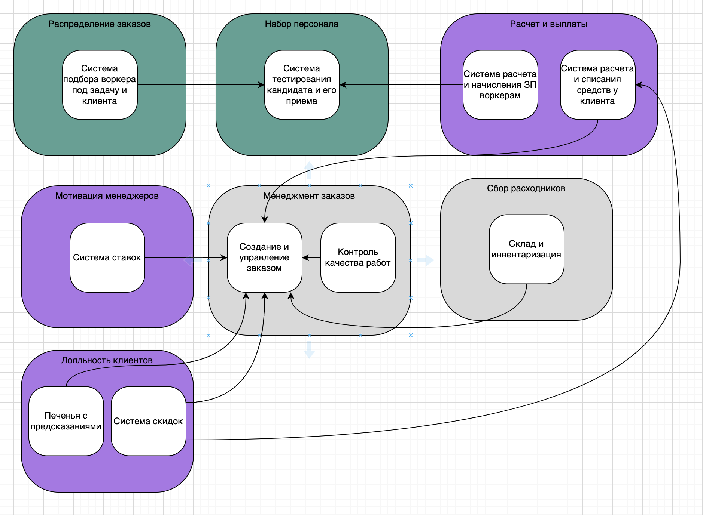
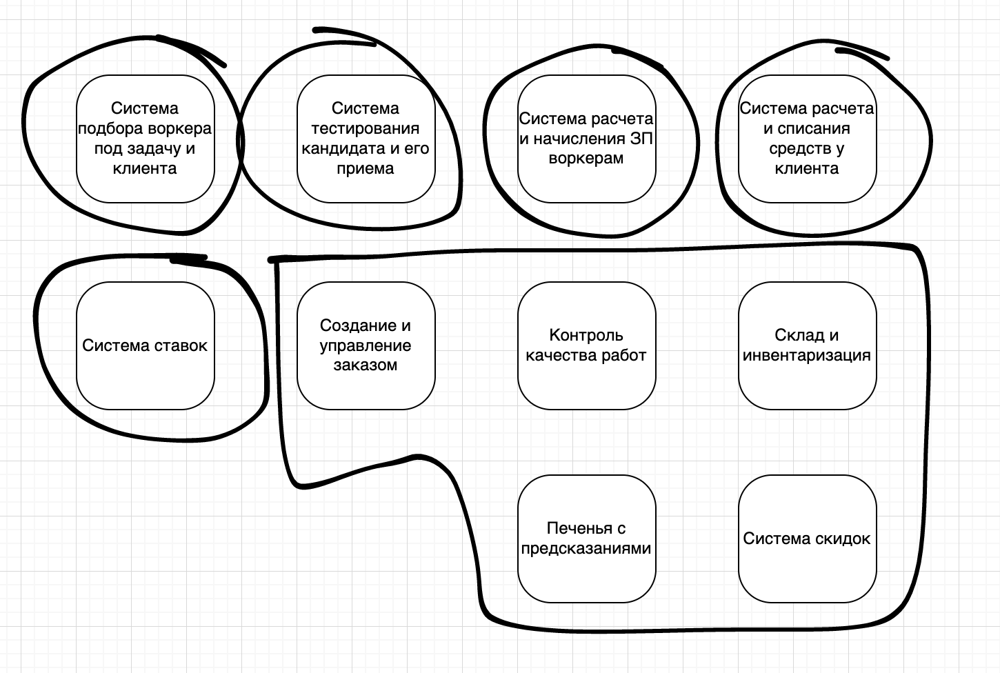
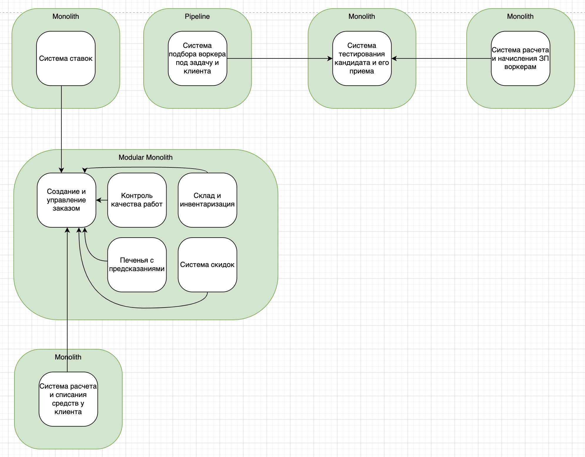
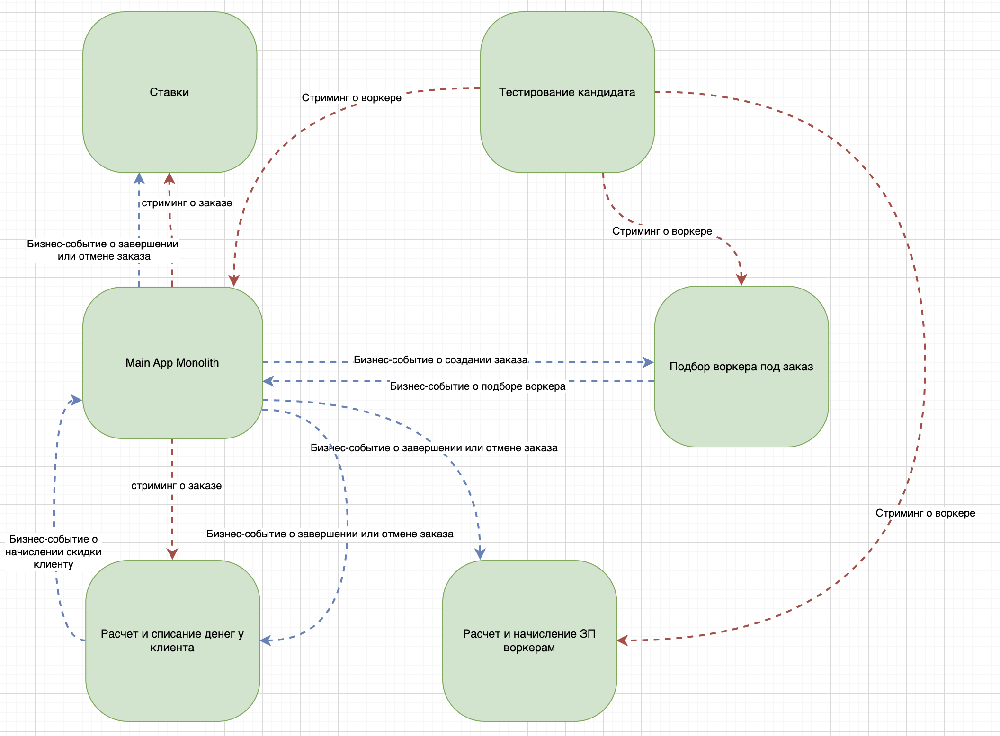

# Общее описание схемы

Все схемы лежат в документе 3hw.drawio. Открывать его с помощью https://app.diagrams.net/ или, для локального скачивания – https://github.com/jgraph/drawio-desktop/releases/tag/v21.2.8 

Схема содержит в себе несколько вкладок: 

- Stakeholders - важность стейкхолдеров
- Subdomains - список субдоменов бизнеса
- Core domain chart – распределение типов доменов по важности для бизнеса
- Bounded contexts with subdomains – определение кограниченных контекстов и соотнесение их с бизнес-доменами
- Event Storming – обновленный ES с новыми контекстами
- Contexts with Relations – модель данных
- Contexts with links – контексты со связями между собой
- Services – контексты со связями между собой
- Communications – коммуникации
- Implementation – реализация

# Исправления в предыдущих разделах

## Subdomains
- поменял состав субдоменов. Было 6, стало 7. 
- изменил имена субдоменов. Например, вместо субдомена "матчинг", появился субдомен "распределение заказов"
- добавил субдомены "лояльность клиента" и "мотивация менеджмента"

Итоговая картинка: 

## Core domain chart
- вслед за субдоменами поменялся, соответственно и core domain chart

## Bounded contexts with subdomains
- логично, что поменялись и ограниченные контексты
- выделил дополнительно контексты для лояльности клиента, а также разделил выплаты воркерам и списание у клиентов на два контекста

## Event Storming
- выделил новые контексты на схеме ES (лучше скачать [файл](./3hw.drawio) и посмотреть полностью)
## Contexts with Relations – модель данных
- подправил модель данных в соответствии с новыми контекстами (тоже лучше скачать [файл](./3hw.drawio) и посмотреть полностью)

## Contexts with links

# Список стейкхолдеров

Примерный список стейкхолдеров, который может быть в проекте: 

</img>

- топ-менеджмент
- Клиенты (коты-тестировщики)
- Воркеры 
- Разработчики 
- админы
- Разработчики алгоритмов матчинга
- менеджеры по набору воркеров
- коты-кандидаты в воркеры
- сотрудники отдела расходников
- сотрудники финотдела 
- менеджеры-тестировщики 
- юристы
- менеджеры отдела контроля качества

# Важность стейкхолдеров

Стейкхолдеров раскидал примерно следующим образом:

Юристов, клиентов и разработчиков раскидал как у Ибрагима. Остальных либо подобно тому, как в уроке, либо по некоему внутреннему наитию. 

# Консерны стейкхолдеров

Жирным выделил важные консёрны, остальные неважные.

## Топ-менеджмент
- **хотят продавать систему скоринга как отдельное решение другим компаниям и тестировать больше гипотез**;
- **релизный цикл для всей системы — месяц**;
- **релизный цикл для скоринга работников — неделя максимум**;

## Клиенты (коты-тестировщики)
- **ожидаемое поведение системы: без сбоев и тупняков**.
## Воркеры 
## Разработчики 
- должно быть понятно, что и где чинить в случае сбоя
## Админы
- простота мониторинга системы для своевременного замечания сбоев, чтобы не работать в авральном режиме
## Разработчики алгоритмов матчинга
- **не хотят делиться алгоритмом**
## Менеджеры
- хотят скрыть систему ставок;
- **ВНЕЗАПНО приходит не 10 заказов в день, а 10 заказов в минуту**;

## Коты-кандидаты в воркеры
## Сотрудники отдела расходников
## Сотрудники финотдела
- **списывать с клиентов раз в месяц**;
- **воркеры всегда работают через "золотую шляпу"**;
- **регулярно добавлять новые способы списания денег с клиентов**;
- **вся финансовая инфа должна надежно храниться**
## Юристы
- **соответствие всей системы правовым нормам**

# Ограничения

| Проблема | Что, если забить |
| --- | --- |
| соблюдение CatFinComplience | маски-шоу | 

agility, testability, deployability – общие требования бизнеса ко всем контекстам. Указывать их к каждому контексту в таблице не вижу смысла.

| Субдомен | Стратегический домен | Ограниченный контекст | Ограничения | Комментарий | 
| --- | --- | --- | --- | --- |
| Распределение заказов | Core | Система подбора воркера под задачу и клиента |  scalability, modifiability, agility  | **scalability** – из желания о расширении в будущем. **modifiability, agility** – из утверждения о том, что этот контекст является ключевым в отличием от конкурентов. В планах большое количество изменений и тесты теорий.  |
| Набор персонала | Core | Система тестирования кандидата и его приема |  modifiability, agility, elasticity, scalability, deployability, modularity|  **modifiability, agility** – из желания проверять много гипотез. **elasticity** – из-за возможности дудоса. **scalability** – из желания расширяться, а также предположения, что 15 менеджеров на 1к заявок в день – маловато. **deployability** – из желания выдерживать отдельный релизный цикл. **modularity** - хочется [продавать](https://www.youtube.com/watch?v=KWHk9FVi2Bw) отдельно|
| Расчет и выплаты | Supporting | Система расчета и начисления ЗП воркерам | securability, consistency |  **securability** – это фининформация и нужно соблюдать секурность. **consistency** – консерн финотдела |
| Расчет и выплаты | Supporting | Система расчета и списания средств у клиента | modifiability, securability, consistency | **modifiability** – из желания добавлять разные типы списаний. **securability** – это фининформация и нужно соблюдать секурность. **consistency** – консерн финотдела |
| Мотивация менеджеров | Supporting | Система ставок | | --- |
| Лояльность клиентов | Supporting | Печенья с предсказаниями | | --- |
| Лояльность клиентов | Supporting | Система скидок | | --- |
| Менеджмент заказов | Generic | Создание и управление заказом | scalability, elasticity | **scalability, elasticity** – из-за внезапной популярности приложения. Нужно держать нагрузку как среднюю, так и пиковую. |
| Менеджмент заказов | Generic | Контроль качества работ | | --- |
| Сбор расходников | Generic | Склад и инвентаризация | | --- |

# Архитектурный стиль

**Система расчета и начисления ЗП воркерам** - отдельный сервис, потому что требование consistency.

**Система расчета и списания средств у клиента** – отдельный сервис, потому что требования consistency и высокий modifiability – финансистам важно добавлять разные способы списания денег. 

**Система тестирования кандидата и его приема**	– отдельный сервис, потому что хотим продавать как отдельное решение и вообще там отдельный релизный цикл у единственного контекста.

**Система подбора воркера под задачу и клиента** – отдельный сервис, потому что там отдельная команда самых умных. Сидят в своем углу задроты и даже термины свои придумали. Ну и в планах строить много гипотез, а значит есть ненулевая вероятность, что релизный цикл поедет. 

**Система ставок** – отдельный сервис, потому что требование скрыть эту возможность хоть и неважное (ишь чего захотели), но пусть будет, мы добрые. Да и захламлять приложение неважной функциональностью не стоит.

**Менеджмент заказов, Контроль качества работ, Склад и инвентаризация, Печенья с предсказаниями, Система скидок** – один большой сервис, потому что кроме внезапно большой нагрузки на менеджмент заказов, других ограничений нет.

Итоговое распределение по сервисам: 

А сервисы со связями выглядят вот так: 

# СУБД 

В сервисе подбора воркера используем графовую БД, так как есть предположение, что эта БД подойдет лучше для работы процесса матчинга. 

В остальных сервисах используем отдельные RDBMS. 

# Коммуникации

Привет АА!

Все коммуникации асинхронные, потому что в синхронных здесь нет особой необходимости. Все синхронные коммуникации, которые могли бы быть, скрылись внутри основного монолита MainApp. 

# Фитнес-функции

TODO

# ADR

TODO