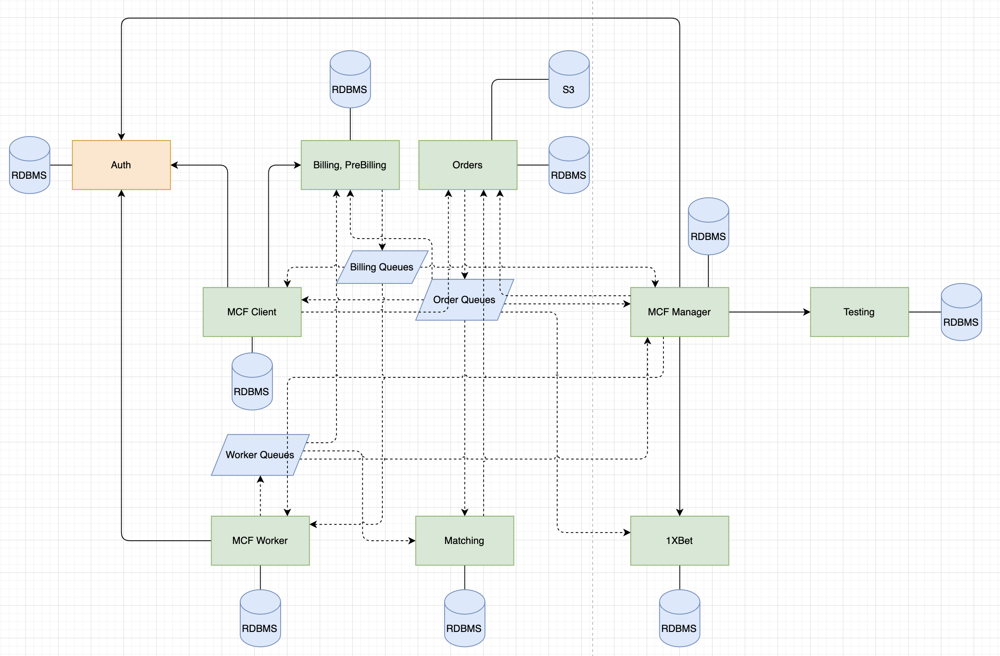

# Описания

## Исходная система 

[Посмотреть описание](../0hw/README.md)

Схема исходной системы

## Итоговая (переделанная) система

[Посмотреть описание со схемами](../3hw/README.md)

## Отличия

- В исходной системе есть entity-сервис Orders, в отличе от финальной системы
- В исходной системе создан единый биллинг-сервис для воркеров и для клиентов
- В исходной системе выделены отдельные сервисы для работы менеджера, клиента и воркера

### Произошедшие изменения

1. Объединили entity-сервис Orders с сервисами воркера, клиента и менеджера в один монолит. В этих сервисах содержатся контексты "создание и управление заказом", "контроль качевта работ", "склад и инвентаризация", "печенья с предсказаниями", "система скидок". Предполагается, что в каждом из сервисов могут быть свои данные, на которые завязана логика, а также вид которых при переносе может быть изменен. Поэтому логичней использовать Data First подход **Change Data Capture**
1. Разбили биллинг на два сервиса – билдинг для воркеров и биллинг для клиентов. Здесь содержатся контексты "система расчета и начисления ЗП воркерам" и "система расчета и списания средств у клиента". На момент разделения данные клиентов и воркеров хранятся в единой схеме БД перемешанные друг с другом, но при переносе модель данных может не меняться (по крайней мере сразу), а остаться преджней для экономии сил/средств. Поэтому здесь для выноса можно использовать паттерн **Tactical Forking**

Остальные сервисы остались без изменений

# Instability

С Instability и связями все очень плохо – я уже не помню, что имел в виду этими стрелочками на схеме. Но опираться больше особо не на что. 

## Orders

У сервиса, одна исходящая связь (стриминг данных в брокер) и минимум 3 входящих связи. Нестабильность для этого сервиса будер равна 1/4

## MCF Worker
У сервиса, одна исходящая связь (стриминг данных в брокер) и минимум 2 входящих связи. Нестабильность для этого сервиса будер равна 1/3

## MCF Client
У сервиса, одна исходящая связь (стриминг данных в брокер) и минимум 2 входящих связи. Нестабильность для этого сервиса будер равна 1/3

## MCF Manager
У сервиса, 2 исходящих связи (запросы в Orders и MCF Worker) и минимум 3 входящих связи. Нестабильность для этого сервиса будер равна 2/5

# План работ
Будем считать, что опыт у людей есть, а ресурсов у компании нет. 

В этом случае:

1. В первую очередь сливаем вместе **MCF Client** и **Orders**, так как считаем, что это принесет максимальный эффект – ускорит работу приложения у клиентов, так как не нужно будет ходить в отдельный энтити-сервис за данными.
1. После этого разделяем биллинг на два сервиса – так как это основные сервисы supporting-поддомена.
1. Дальше сливаем **MCF Wroker**, а за ним – **MCF Manager**. 

